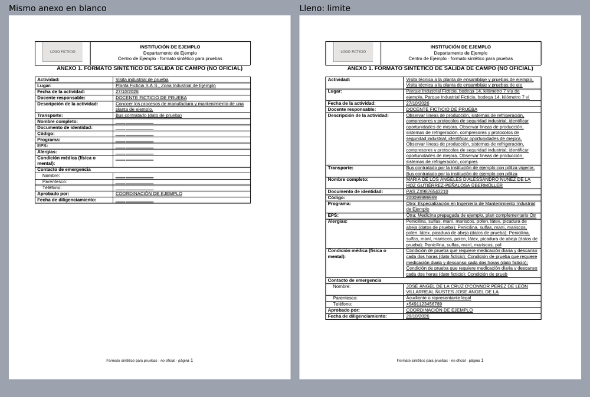
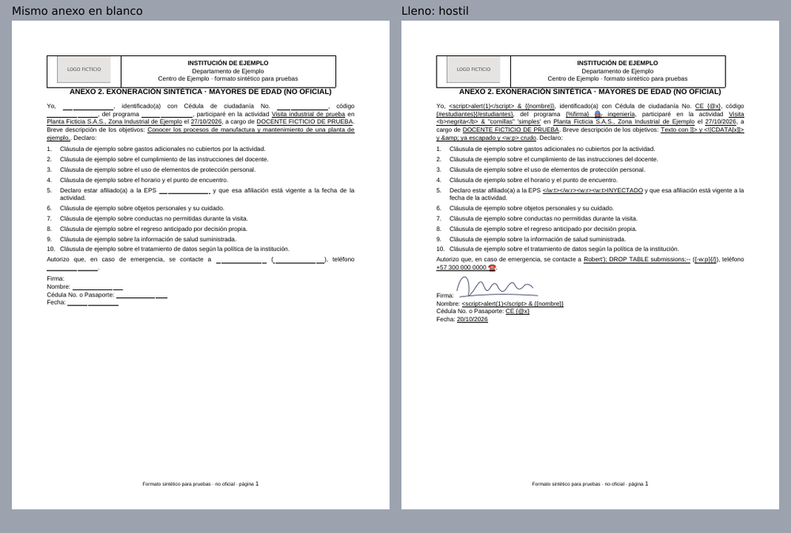
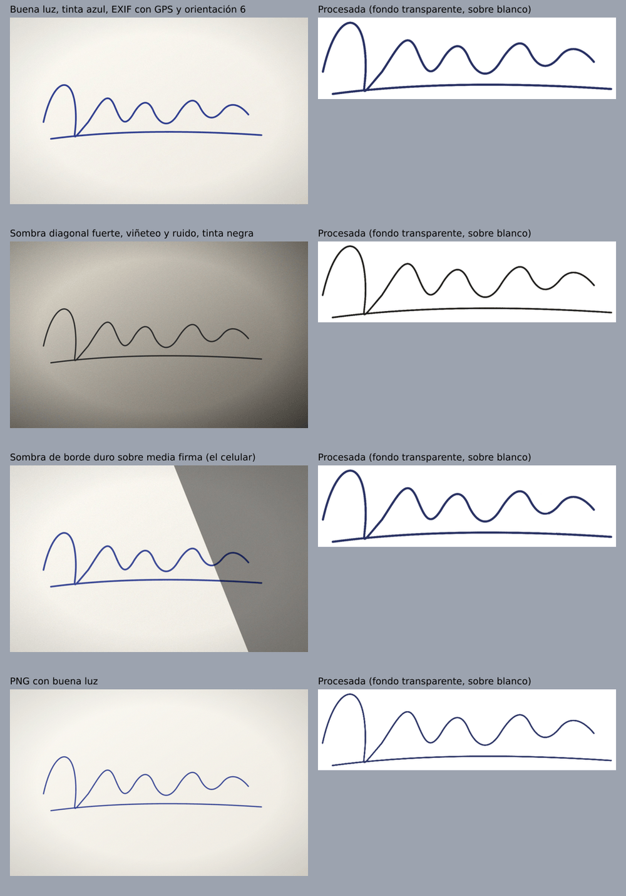

# SPIKE · Fase 0 (fidelidad, firma y entrega de correo)

> 29/09/2026 · PLAN v1.4 §15 Fase 0 · Estado: **parcial, en modo SINTÉTICO**.
> No hay GO para la Fase 1 (regla 2). Este documento reporta lo que se pudo
> ejecutar con evidencia y lo que sigue bloqueado por insumos humanos.

## 0. Resumen

| | Estado |
|---|---|
| Pipeline DOCX → PDF (docxtemplater + Gotenberg 8) | ✅ Funciona de punta a punta con un DOCX sintético de la misma estructura |
| Datos límite y hostiles | ✅ 12/12 renders: sin XML roto, sin inyección, misma estructura, mismas páginas |
| Firma por foto (S8) | ✅ 11/11 casos sintéticos dan el resultado esperado; PNG sin EXIF/GPS |
| Módulo de imágenes gratuito | ⚠️ Compatible con docxtemplater 3.71 **con dos arreglos** (H-1, H-2) |
| Fidelidad frente al formato oficial | ⏳ **Bloqueado**: falta `Anexos_Salidas_de_campo.docx` (H3) y los PDF de Word por anexo (H4) |
| Fotos reales de firma (iPhone, Android, HEIC) | ⏳ **Bloqueado**: faltan fotos reales |
| Entrega de correo OTP | ⏳ **Bloqueado**: falta dominio verificado (H6) y cuentas de prueba (H10) |
| Cold start en el hosting real | ⏳ Pendiente de elegir Cloud Run o Railway (H7). Medido solo en Docker local |

**Recomendación provisional: A (docxtemplater + Gotenberg).** Se confirma o
se cambia a B cuando el DOCX real pase por `npm run spike` (§5).

## 1. Qué se ejecutó y cómo reproducirlo

```bash
cp .env.example .env            # definir GOTENBERG_PASSWORD
docker compose up -d gotenberg
npm install
npm test                        # 21 pruebas unitarias
npm run spike -- --cold         # reinicia Gotenberg y mide el arranque
```

Salidas en `out/spike/` (no versionado): PDF por anexo y juego de datos,
imágenes lado a lado, `report.json`, `inspect.txt` y las firmas procesadas.
Las imágenes livianas de este documento están en `docs/spike/`.

**Modo sintético.** Sin el DOCX oficial, `scripts/spike/synthetic-docx.ts`
arma un DOCX **no oficial** (textos inventados, "INSTITUCIÓN DE EJEMPLO",
logo ficticio) con la estructura que describe el plan: tabla de encabezado
con logo al inicio de cada anexo (§8 regla 7), tabla de datos con sub-filas
del contacto de emergencia (regla 9), marcadores subrayados en línea (regla
6), 10 cláusulas numeradas con la EPS en la 5, bloque de firma y los 4 anexos
en un solo archivo (regla 10). El spike lo separa en 4 plantillas y compara
cada anexo lleno contra **el mismo anexo en blanco** (no contra Word).

Versiones: Node 22.22 · docxtemplater 3.71.0 · docxtemplater-image-module-free
1.1.1 · sharp 0.35.5 · Gotenberg 8.37.0 (LibreOffice 26.8.0.3) · poppler 24.02.

## 2. Resultados

### 2.1 Gotenberg (S10)

| Prueba | Resultado |
|---|---|
| `POST /forms/libreoffice/convert` sin credenciales | `401` |
| `POST /forms/chromium/convert/url` con credenciales | `404` (ruta deshabilitada) |
| Puerto | Solo `127.0.0.1:3000` |
| Reinicio del contenedor → `/health` OK | 596 ms |
| Primera conversión tras el reinicio (arranca LibreOffice) | 989 ms |
| Conversiones en caliente (n = 10) | p50 297 ms · p95 953 ms |

El p95 corresponde al reinicio programado de LibreOffice
(`--libreoffice-restart-after=10`). Es Docker local: el cold start de Cloud
Run/Railway (descarga de imagen + arranque) **no está medido**.

### 2.2 Renders (4 anexos × 3 juegos de datos)

Juegos en `scripts/fake-data.ts`, todos ficticios (regla 5):
- **normal**;
- **límite**: nombre de 80 caracteres con tildes, ñ, `D'ALESSANDRO`, "DE LA
  HOZ", pasaporte, EPS "Otra" de 60, alergias y condición médica de 300,
  teléfono internacional, descripción de 500;
- **hostil**: `<script>`, `{{nombre}}`, `{@x}`, `{#estudiantes}`, `{%firma}`,
  `</w:t></w:r><w:r><w:t>INYECTADO`, `]]>`, caracteres de control, override
  bidi, fórmula `=HYPERLINK(...)`, SQL, emoji con ZWJ.

| Anexo | normal | límite | hostil |
|---|---|---|---|
| 1 · salida de campo | 1 pág = base · 9/9 valores | 1 pág = base · 9/9 | 1 pág = base · 9/9 |
| 2 · mayores | 1 pág = base · 7/7 | 1 pág = base · 7/7 | 1 pág = base · 7/7 |
| 2 · menores | 1 pág = base · 8/8 | 1 pág = base · 8/8 | 1 pág = base · 8/8 |
| 3 · autorización | 1 pág = base · 6/6 | 1 pág = base · 6/6 | 1 pág = base · 6/6 |

En los 12 casos: `document.xml` bien formado, mismo número de `w:p`, `w:tbl`,
`w:tr`, `w:tc`, `w:hyperlink` y campos que la versión normal, y ningún
elemento fuera de OOXML. Todo texto hostil sale literal en el PDF.

Anexo 1 con datos límite (tabla que crece dentro de la misma página):



Anexo 2 mayores con datos hostiles y firma:



Resto: `docs/spike/*.side-by-side.png`.

### 2.3 Firma por foto (D15, S8, §14)

| Caso (sintético) | Esperado | Resultado |
|---|---|---|
| Buena luz, tinta azul, EXIF con GPS y orientación 6 | ok | ok · 900×245 · sin EXIF · sale horizontal |
| Sombra diagonal fuerte, viñeteo y ruido, tinta negra | ok | ok · 900×244 |
| Sombra de borde duro sobre media firma | ok | ok · 900×245 |
| PNG ya reducido | ok | ok · 755×204 |
| PNG de 1.600 px sin reducir (> 1,5 MB) | `too_large` | `too_large` |
| Hoja sin firma | `no_ink` | `no_ink` |
| Foto casi negra | `too_dark` | `too_dark` |
| Trazo más alto que ancho | `bad_aspect` | `bad_aspect` |
| 40 megapíxeles | `too_many_pixels` | `too_many_pixels` |
| Texto con extensión `.png` | `bad_type` | `bad_type` |
| Cabecera HEIC | `heic_not_supported` | `heic_not_supported` |

Algoritmo (`scripts/spike/signature.ts`): magic bytes → límites (1,5 MB,
2.000 px por lado, 4 MP) → orientación EXIF → gris → **fondo estimado a 1/8 de
escala con mediana 7 + desenfoque** → normalización píxel/fondo → umbral de
Otsu (tope 200) con borde suave → tinta 0,5 %-30 % → recorte a la tinta →
proporción 1:1-6:1 → PNG RGBA de un solo color de tinta (el promedio de la
tinta, oscurecido) → máx. 900 px de ancho. `sharp` no copia metadatos a la
salida: el PNG no trae EXIF ni GPS (probado).



En el documento, `getSize` usa las medidas reales del PNG ajustadas a 180×60
sin deformar (§8 regla 11): 900×245 → 180×49.

## 3. Hallazgos

| # | Hallazgo | Qué se hizo |
|---|---|---|
| H-1 | `docxtemplater-image-module-free` trata cualquier valor de tipo objeto (también un `Buffer`) como imagen ya resuelta `{rId, sizePixel}` y revienta con `Cannot read properties of undefined (reading '0')`. | El marcador recibe una clave de texto (`'firma'`) y `getImage` la resuelve. Probado. |
| H-2 | El módulo depende de `xmldom@^0.1.27`: `npm audit` da 1 crítica y 1 moderada, sin arreglo (el paquete no se publica desde 2019). | `overrides` en `package.json` → `@xmldom/xmldom@^0.8.11` (misma API). `npm audit`: 0. Ver DECISIONS. |
| H-3 | `sharp.dilate()` es morfología binaria, y una tubería que parte de un buffer crudo de 1 canal devuelve 3 canales: la estimación del fondo salía corrupta y la foto con sombra marcaba 29 % de "tinta". | Fondo por mediana a escala reducida y `extractChannel(0)` explícito, con verificación de tamaño. |
| H-4 | Un override bidi (`U+202E`) dentro de un campo libre se ve **invertido** en el PDF ("requesto"). No rompe el documento pero permite texto engañoso. | Fase 2: la normalización de §14 debe quitar `U+202A-202E` y `U+2066-2069` de todos los campos. `stripInvalidXMLChars` ya quita los caracteres de control. |
| H-5 | Si la descripción del evento termina en punto y el formato pone un punto después del marcador, sale "..". | No se toca el formato (regla 6). Fase 4: el panel avisa o quita el punto final de la descripción. |
| H-6 | Gotenberg 8.37 trae LibreOffice 26.8; el LibreOffice del sistema es 24.2. | La referencia de fidelidad es siempre Gotenberg; `soffice` local solo es respaldo de desarrollo. |
| H-7 | El formato en blanco rellena los campos del estudiante con 30 espacios no separables subrayados: a 150 dpi la línea es continua. | Validar contra las líneas `____` del formato real. |
| H-8 | El DOCX sintético usa Arial; Gotenberg la sustituye por Liberation Sans (métrica compatible) según `pdffonts`. | Con el DOCX real: `npm run docx:inspect` lista las fuentes; las que falten van a `gotenberg/fonts/`. |
| H-9 | **El repositorio es público** (`visibility: public`), y la regla 11 exige que sea privado. | El DOCX oficial, los PDF de referencia y las fotos reales quedan en `.gitignore`. No subirlos hasta que el repo sea privado. |

## 4. Criterios de aceptación de la Fase 0

| Criterio | Estado |
|---|---|
| Cada uno de los 4 anexos: mismas páginas y saltos que su PDF de Word; encabezado, logo y tablas intactos; aprobado por escrito por el organizador | ⏳ Falta DOCX real (H3) y PDF de Word (H4). Con el sintético, las páginas no cambian con datos límite ni hostiles |
| Ningún dato hostil rompe el documento ni inyecta XML | ✅ Sintético (12/12). Repetir con el DOCX real |
| Firma legible, transparente, sin deformarse y bien posicionada desde fotos reales de iPhone y Android con buena y mala luz | ⏳ ✅ con fotos sintéticas; faltan fotos reales y HEIC de un iPhone |
| 5/5 correos en < 60 s en bandeja principal | ⏳ `npm run mail:test` listo; falta H6 y H10 |

## 5. Para cerrar la Fase 0

1. **Hacer privado el repositorio** (H-9, regla 11).
2. Copiar `Anexos_Salidas_de_campo.docx` a `fixtures/templates/` y correr
   `npm run docx:inspect -- fixtures/templates/Anexos_Salidas_de_campo.docx --blocks`
   (fuentes, resaltados, marcas `XXXX`/`AUTOMATICO`/`ADMIN LO DEJA CARGADO`/
   `IMAGEN DE FIRMA`, primera página diferente, bloques).
3. Separar: `npm run docx:split -- fixtures/templates/Anexos_Salidas_de_campo.docx`
   (corta en cada tabla con "UNIVERSIDAD DEL NORTE"; si no cuadra, `--at i,j,k,l`).
4. Preparar las 4 plantillas: reemplazar cada marca por su marcador de §8 y
   quitar el resaltado, sin tocar el resto. Guardarlas en
   `fixtures/templates/prepared/{anexo-1,anexo-2-mayores,anexo-2-menores,anexo-3}.docx`.
5. Exportar desde **Word** un PDF por anexo a
   `fixtures/templates/reference/<anexo>.pdf` (H4).
6. Fotos reales de una firma (iPhone y Android, buena y mala luz, un HEIC) en
   `fixtures/signatures/real/` (no se versionan).
7. `npm run spike -- --cold`: el spike pasa solo a **modo REAL** y compara
   contra Word.
8. H6 + H10: `MAIL_TEST_TO=... npm run mail:test` y anotar hora de llegada y
   carpeta de cada correo.
9. Decisión humana: A, B o papel (§15) y "GO Fase 1".
